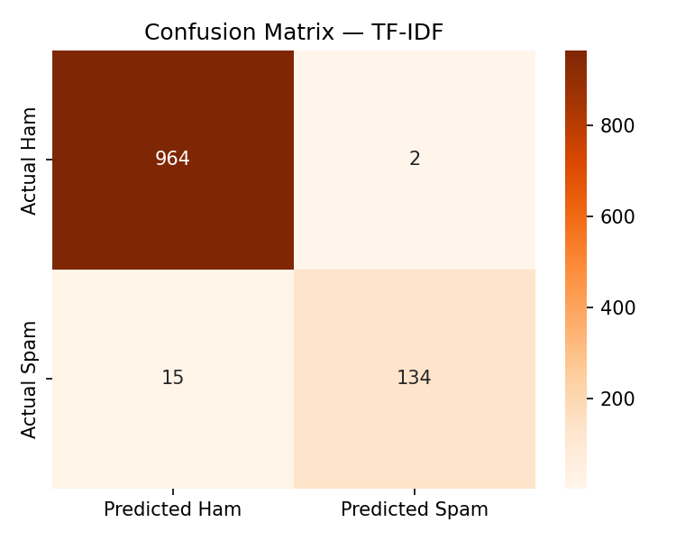
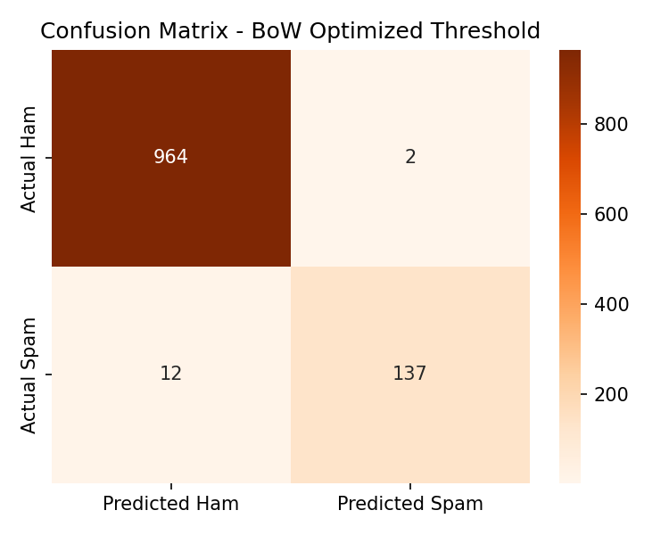

# SVM Spam Classifier

A hands-on project exploring Support Vector Machines (SVM) for binary text classification, built while working through [*The Hundred-Page Machine Learning Book*](https://themlbook.com/wiki/doku.php) by Andriy Burkov.

## Learning Goals

- Understand how SVMs find a maximum-margin decision boundary between two classes
- Apply bag-of-words feature extraction to convert raw text into numeric feature vectors
- Train a linear SVM on real SMS data and evaluate its performance
- Visualize how model accuracy changes as training set size grows (learning curve)
- Interpret a confusion matrix and understand the tradeoff between precision and recall in spam detection

## Dataset

[SMS Spam Collection](https://archive.ics.uci.edu/dataset/228/sms+spam+collection) — 5,574 SMS messages labeled `ham` (not spam) or `spam`.

## Approach

1. Load and explore the dataset
2. Convert messages to bag-of-words feature vectors using `CountVectorizer`
3. Train a linear SVM (`LinearSVC`) on a training split
4. Evaluate with accuracy, confusion matrix, and precision/recall/F1
5. Plot a learning curve (accuracy vs. training set size)
6. Plot a hyperparameter sweep (accuracy vs. `C`)

## Results Summary

### **Iteration 1** — LinearSVC, C=1.0, Bag of Words


| Metric | Score |
|---|---|
| Test accuracy | 0.9830 |
| Ham F1 | 0.9916 |
| Spam F1 | 0.9319 |
| Spam precision | 1.0000 (zero false positives) |
| Spam recall | 0.8725 (13% of spam missed) |

The model achieves perfect spam precision — no legitimate mail was incorrectly flagged. Recall is lower at 0.87, meaning ~13% of spam slipped through. For a spam filter this is the preferred tradeoff. See [RESULTS.md](RESULTS.md) for full analysis.

### **Iteration 2** — LinearSVC, C=1.0, TF-IDF

TF-IDF introduces a small number of false positives (ham flagged as spam) in exchange for catching more spam:

| | BoW | TF-IDF |
|---|---|---|
| False Positives (Type I) | 0 | ~2 |
| False Negatives (Type II) | ~19 | ~15 |



| Metric | Score |
|---|---|
| Test accuracy | 0.9848 (+0.0018 vs. BoW) |
| Spam F1 | 0.9404 (+0.0085 vs. BoW) |
| Spam precision | 0.9853 |
| Spam recall | 0.8993 (+0.0268 vs. BoW) |


TF-IDF improves spam recall from 0.8725 → 0.8993 at the cost of introducing a small number of false positives (precision 1.0000 → 0.9853).

### **Iteration 3** — BoW + decision threshold = -0.3392




| Metric | Score |
|---|---|
| Test accuracy | 0.9874 (best so far) |
| Spam F1 | 0.9514 (best so far) |
| Spam precision | 0.9856 |
| Spam recall | 0.9195 (best so far) |

Lowering the decision threshold on the BoW model (no retraining) outperforms TF-IDF on all key metrics. See [RESULTS.md](RESULTS.md) for full analysis.

---

## Setup

```bash
pip install -r requirements.txt
jupyter notebook spam_classifier.ipynb
```

## Project Structure

```
svm-spam-classifier/
├── data/               # Raw dataset (downloaded on first run)
├── spam_classifier.ipynb
├── requirements.txt
└── README.md
```
