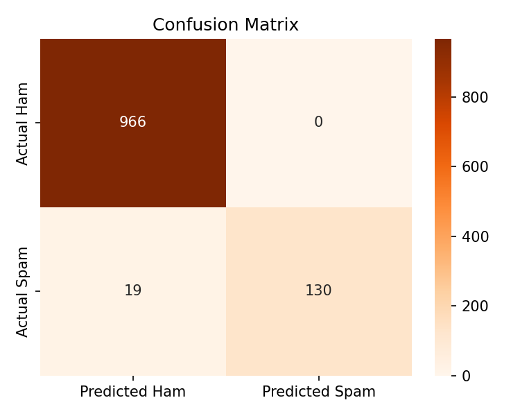
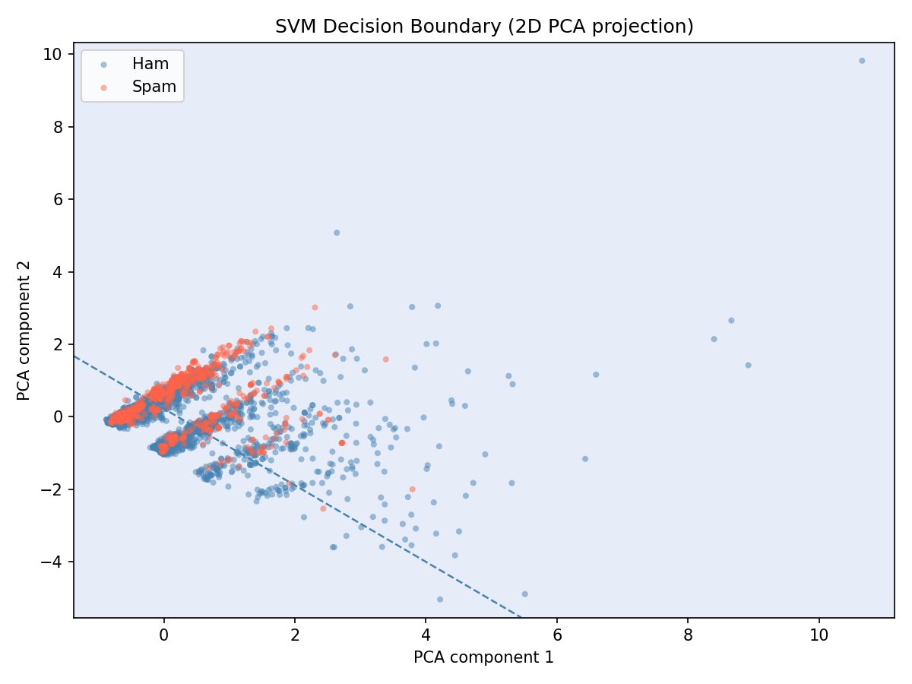
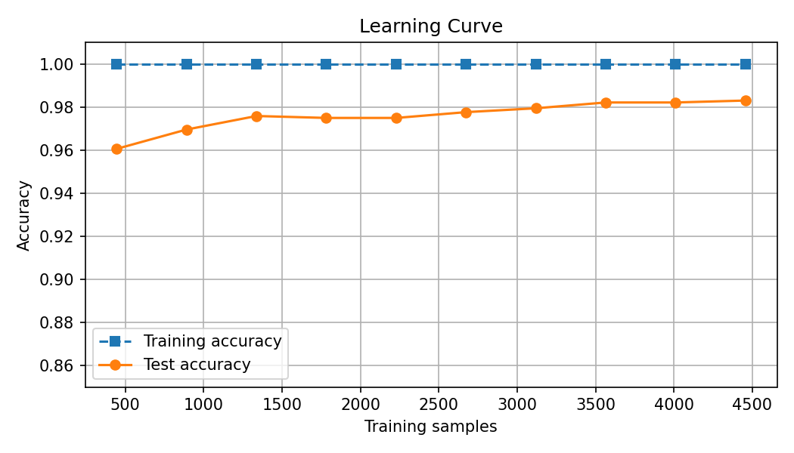
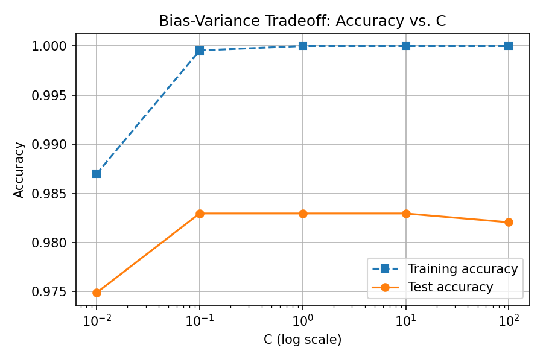
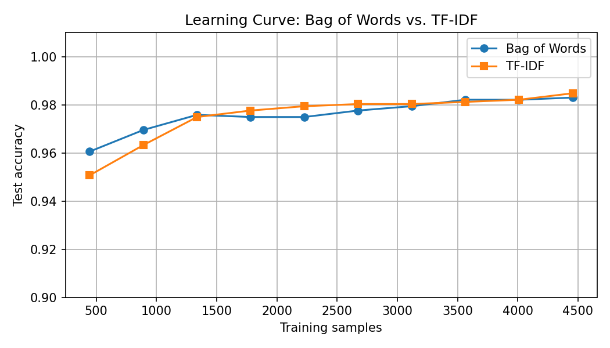
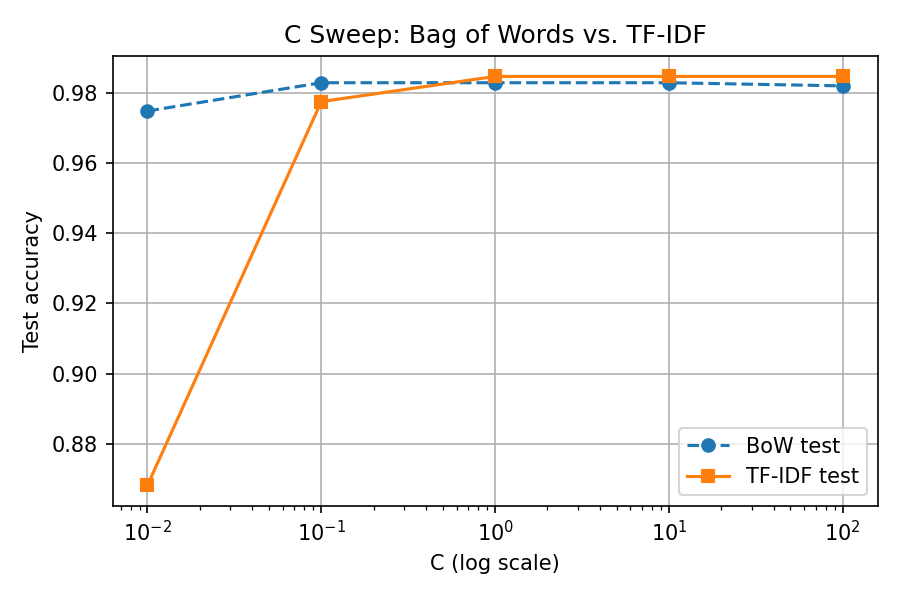
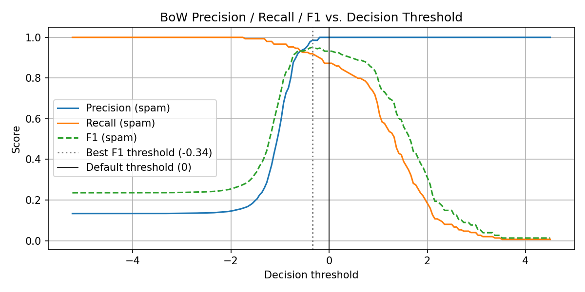
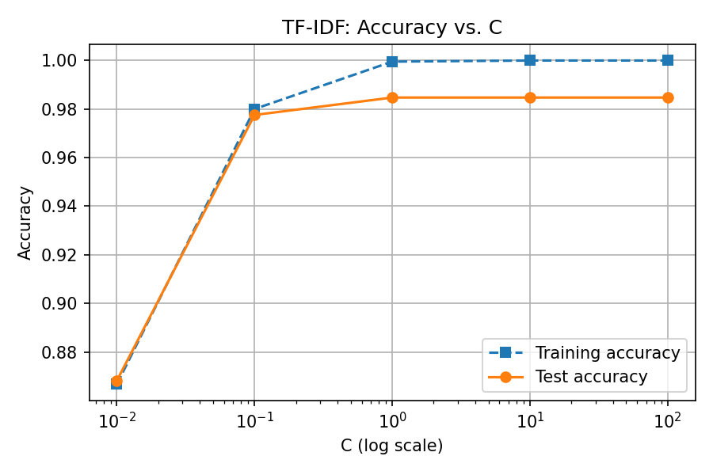

# Results — Iteration 1

**Model:** LinearSVC, C=1.0  
**Features:** Bag of Words (CountVectorizer)  
**Dataset:** UCI SMS Spam Collection — 5,574 messages (80/20 split)

---

## Accuracy

**Test accuracy: 0.9830**

---

## Classification Report

|          | Precision | Recall | F1     | Support |
|----------|-----------|--------|--------|---------|
| Ham      | 0.9834    | 1.0000 | 0.9916 | 966     |
| Spam     | 1.0000    | 0.8725 | 0.9319 | 149     |
| Accuracy |           |        | 0.9830 | 1115    |

---

## Confusion Matrix

Each cell shows the count of predictions. The model produces **zero false positives** (no ham flagged as spam) but misses ~13% of actual spam (false negatives / Type II errors). For a spam filter this is the preferred tradeoff — silently deleting legitimate mail is worse than occasionally letting spam through.

---

## SVM Decision Boundary (2D PCA Projection)

The SVM operates in a ~7,000-dimensional word-count space. This plot projects that space down to 2 principal components for visualization. The black line is the **decision boundary**; dashed lines show the **margin**. Cluster / boundary overlap is expected — PCA captures only a small fraction of the total variance, so the separation looks messier here than it actually is in the full feature space.

---

## Learning Curve

Training accuracy (dashed) stays near 1.0 throughout, while test accuracy rises quickly and converges around 500 samples. The small and stable gap between the two lines indicates the model generalizes well and is not significantly overfitting.

---

## Bias-Variance Tradeoff: Accuracy vs. C

Sweeping the regularization parameter `C` over five orders of magnitude. At very small `C` (high regularization), the model underfits — both training and test accuracy are low. As `C` increases, test accuracy peaks around `C=1` and plateaus. Training accuracy reaches 1.0 at large `C`, while test accuracy stays flat — the classic signature of overfitting. `C=1` is the sweet spot.

---

## Key Findings

**Precision vs. Recall tradeoff:**  
Spam precision is perfect (1.00) — every message flagged as spam actually was spam, meaning zero false positives (Type I errors). However, spam recall is 0.87, meaning ~13% of spam messages slipped through as ham (Type II errors). For a spam filter, this is the preferred tradeoff: it's better to occasionally miss spam than to incorrectly delete legitimate mail.

**Class imbalance:**  
The dataset is heavily skewed — 966 ham vs. 149 spam in the test set (~87% ham). High overall accuracy (98.3%) is partly a reflection of this imbalance; a naive classifier that predicted "ham" for everything would score ~87%. The F1 scores per class are the more meaningful metric here.

**Bag of Words is sufficient:**  
A simple word-count representation with a linear kernel achieves strong results on this dataset, consistent with the book's observation that text data is often linearly separable in high-dimensional feature spaces.

---

## Next iteration candidates

- Decision threshold sweep — lower the classification threshold to improve spam recall
- N-grams (bigrams) — "free prize", "you won" are stronger signals than individual words
- Class weights — penalize missed spam more heavily during training (directly targets recall)

---

# Iteration 2: TF-IDF Features

**Model:** LinearSVC, C=1.0  
**Features:** TF-IDF (TfidfVectorizer)

## Accuracy

| Feature Method | Test Accuracy |
|---|---|
| Bag of Words (Iteration 1) | 0.9830 |
| TF-IDF (Iteration 2)       | 0.9848 |

## Classification Report

|          | Precision | Recall | F1     | Support |
|----------|-----------|--------|--------|---------|
| Ham      | 0.9847    | 0.9979 | 0.9913 | 966     |
| Spam     | 0.9853    | 0.8993 | 0.9404 | 149     |
| Accuracy |           |        | 0.9848 | 1115    |

## Learning Curve: BoW vs. TF-IDF

TF-IDF converges slightly faster and sits consistently above bag-of-words across all training sizes, though the gap is small. Both methods plateau well before using the full training set.

## C Sweep: BoW vs. TF-IDF

TF-IDF matches or slightly outperforms bag-of-words at 1+ values of `C`. Both plateau at `C=1` — increasing regularization beyond that yields no further test accuracy gain.

## Key Findings

TF-IDF improves overall accuracy by +0.0018 (0.9830 → 0.9848) and spam recall by +0.0268 (0.8725 → 0.8993), while spam precision drops marginally (1.0000 → 0.9853). The net effect is a better spam F1 (0.9319 → 0.9404).

The recall improvement is the most meaningful gain: TF-IDF catches ~9 more spam messages per 1,000 compared to bag-of-words, at the cost of occasionally flagging a legitimate message as spam (previously zero false positives).

---

# Iteration 3: Decision Threshold Sweep + TF-IDF C Sweep

## Section 9: Decision Threshold Sweep

Best threshold applied to the bag-of-words model (no retraining required).

**Best threshold: -0.3392**

|          | Precision | Recall | F1     | Support |
|----------|-----------|--------|--------|---------|
| Ham      | 0.9877    | 0.9979 | 0.9928 | 966     |
| Spam     | 0.9856    | 0.9195 | 0.9514 | 149     |
| Accuracy |           |        | 0.9874 | 1115    |

Lowering the threshold from 0 to -0.3392 shifts the model to flag messages as spam even when it is less confident. Spam recall jumps from 0.8725 → 0.9195 (+0.0470) with only a tiny precision drop (1.0000 → 0.9856). This is the best spam recall achieved so far and requires no retraining — just a post-hoc threshold adjustment.

## Section 10: TF-IDF + C Sweep

| C | Train | Test |
|---|---|---|
| 0.01 | 0.8667 | 0.8682 |
| 0.1  | 0.9800 | 0.9776 |
| 1    | 0.9996 | 0.9848 |
| 10   | 1.0000 | 0.9848 |
| 100  | 1.0000 | 0.9848 |

TF-IDF test accuracy plateaus at C=1 (0.9848) and does not improve with higher C, while training accuracy reaches 1.0 — confirming C=1 as the optimal value. This is consistent with Iteration 1's BoW C sweep.

## Progress Summary

| Iteration | Change | Accuracy | Spam Recall | Spam F1 |
|---|---|---|---|---|
| 1 | BoW, C=1, threshold=0   | 0.9830 | 0.8725 | 0.9319 |
| 2 | TF-IDF, C=1             | 0.9848 | 0.8993 | 0.9404 |
| 3 | BoW, threshold=-0.3392  | 0.9874 | 0.9195 | 0.9514 |

The threshold sweep on the BoW model (Iteration 3) outperforms TF-IDF (Iteration 2) on both accuracy and recall, with no additional training cost.
